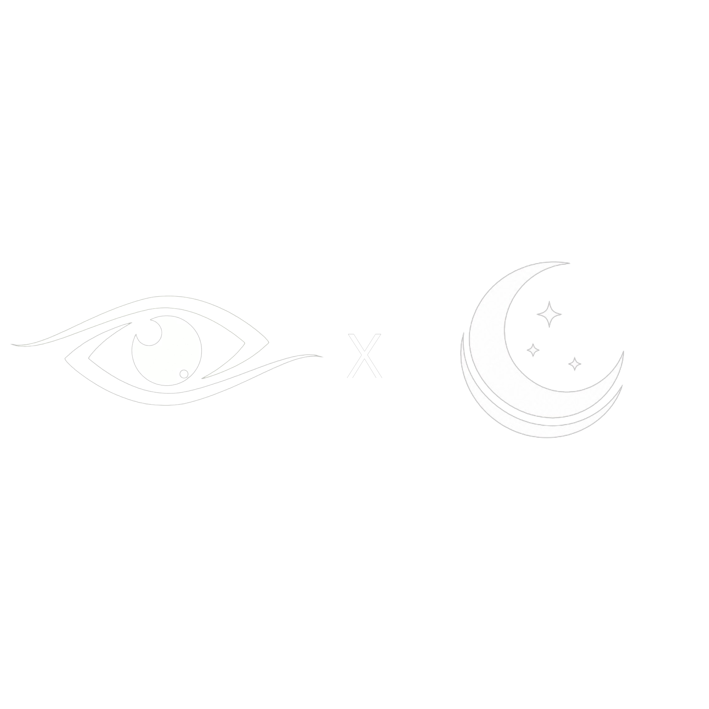
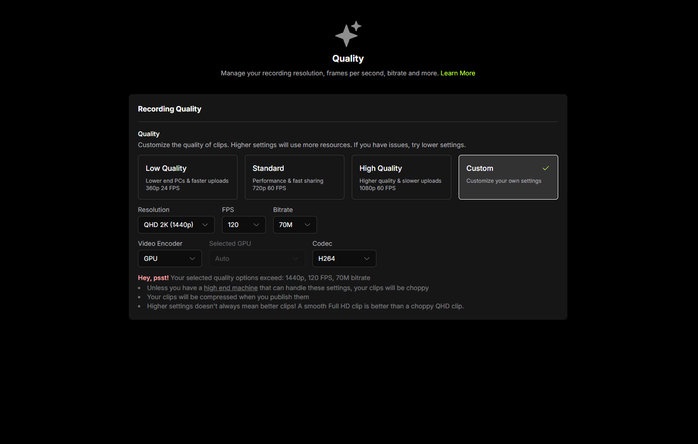
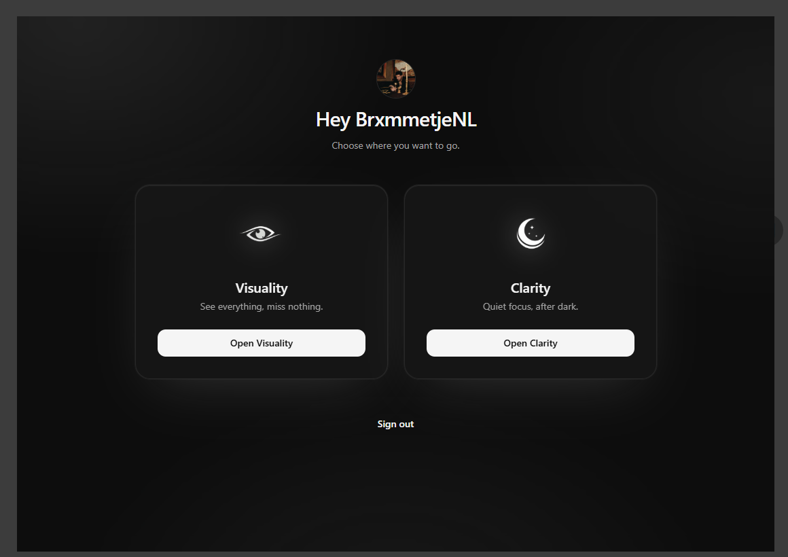

	

	# Visuality x Clarity Video Editor

	**An aesthetic, powerful, and streamlined editing application built for modern creators.**

	
	
	
	
	

	---

	[Download Latest Release](https://github.com/melle1407/visuality-x-clarity-release/releases) • [Join Visuality](https://discord.gg/visuality) • [Join Clarity Services](https://discord.gg/clarityservices)

 

## 📸 Interface Preview

| Login & Authentication | Workspace View |
| :---: | :---: |
|  |  |

 

## ✨ Features

- **Modern & Minimal UI:** Designed from the ground up for speed, aesthetics, and zero visual clutter.
- **Seamless Authentication:** Secure login flow powered by integrated authentication.
- **Optimized Performance:** Fast video processing engine tailored for smooth playback and timeline scrub.
- **Creator Resources:** Built-in hooks and integrations powered by **Visuality** and **Clarity Services**.

 

## 🛡️ Security & Integrity Scan

We prioritize safety and transparency. Every release is thoroughly analyzed across major security engines prior to deployment.

| File Verification | Details |
| :--- | :--- |
| **File Name** | `Visuality-Clarity-1.0.0-x64.zip` |
| **File Size** | `156.09 MB` |
| **VirusTotal Result** | **0 / 54 Security Vendors Flagged (100% Clean)** |
| **SHA-256 Hash** | `a3aae7d80829683e87f135de5152c3286f20b563b60b6c2dd1d343fa01f67151` |

> [!NOTE]
> Verify the SHA-256 checksum of your downloaded `.zip` file against the hash listed above before extracting it.

 

## 🚀 Getting Started

### Installation

1. Go to the [Releases Page](https://github.com/melle1407/visuality-x-clarity-release/releases/latest).
2. Download `Visuality-Clarity-1.0.0-x64.zip`.
3. Extract the ZIP and run `Visuality & Clarity.exe`.

### Screenshots

The screenshots in this README are stored in `docs/screenshots`.

 

## 💬 Community & Support

Need help, have feature suggestions, or want to showcase your edits? Join our official Discord servers:

| Visuality | Clarity Services |
| :---: | :---: |
| [Join Visuality Community](https://discord.gg/visuality) | [Join Clarity Services](https://discord.gg/clarityservices) |

 

## 🤝 Collaboration

This application is brought to you by the combined efforts of **Visuality** and **Clarity Services**.

	Created with ❤️ by <a href="https://github.com/melle1407">melle1407</a> & Teams.

