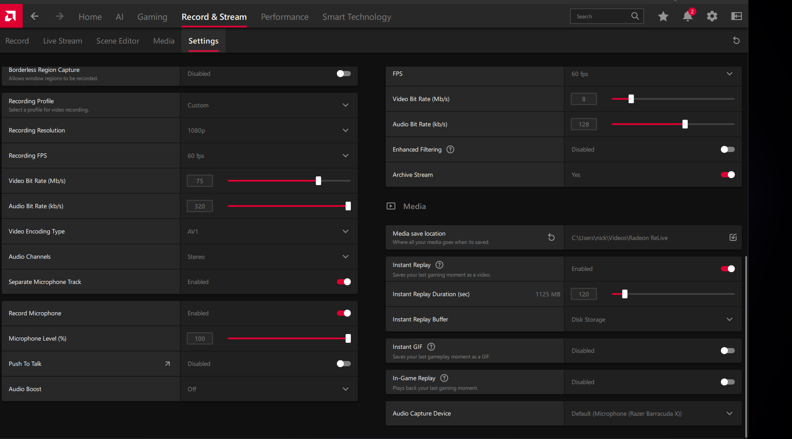
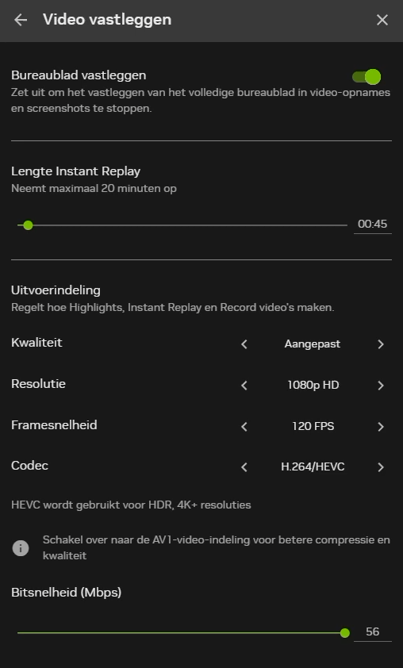

<div align="center">

	

	# Visuality x Clarity Suite

	**An aesthetic, powerful, and streamlined desktop experience built for modern creators.**

	[](https://github.com/melle1407/visuality-x-clarity-release/releases)
	[](https://github.com/melle1407/visuality-x-clarity-release/releases)
	[](https://www.virustotal.com/)
	[](https://discord.gg/visuality)
	[](https://discord.gg/clarityservices)

	<br />

	[Download Latest Release](https://github.com/melle1407/visuality-x-clarity-release/releases) • [Join Visuality](https://discord.gg/visuality) • [Join Clarity Services](https://discord.gg/clarityservices)

</div>

## Interface Preview

<div align="center">

| Workspace | Product View |
| :---: | :---: |
|  |  |

<br />



</div>

## Features

- **Modern, minimal interface:** Focused layouts with a restrained visual system.
- **Discord authentication:** One login flow for Visuality and Clarity access.
- **Rounded desktop shell:** Scrollable screens with consistent window clipping and draggable space.
- **Creator resources:** Product content and resources for Visuality and Clarity users.
- **Cross-platform release:** macOS ARM64 and Windows x64 builds are published from GitHub Releases.

## Download

Download the latest files from the [GitHub Releases page](https://github.com/melle1407/visuality-x-clarity-release/releases/latest).

### Windows

Download `Visuality-Clarity-1.0.0-x64.zip`, extract it, and run `Visuality & Clarity.exe`.

### macOS

Download `Visuality-Clarity-1.0.0-arm64.dmg`, open it, and drag the app into Applications.

## Security Verification

The Windows ZIP was scanned by VirusTotal with no vendors flagging it at the time of release.

| File | Value |
| :--- | :--- |
| File | `Visuality-Clarity-1.0.0-x64.zip` |
| Size | 156.09 MB |
| VirusTotal | 0 / 54 vendors flagged |
| SHA-256 | `a3aae7d80829683e87f135de5152c3286f20b563b60b6c2dd1d343fa01f67151` |

Verify the SHA-256 checksum of the downloaded ZIP before extracting it.

## Project Structure

- `apps/visual-hero-effect`: launch screen and hero experience
- `apps/welcome-hub`: Discord login, license checks, app picker, and Electron release shell
- `apps/vision-clarity-hub`: Visuality and Clarity product content
- `docs/`: README logo and interface screenshots

## Development

Each app has its own `package.json` and build scripts. Run commands from the relevant app directory:

```bash
npm install
npm run dev
```

Never commit `.env` files or server secrets. Use the hosting provider's secret store for Discord, Supabase, and session secrets.

## Community & Support

- [Visuality Discord](https://discord.gg/visuality)
- [Clarity Services Discord](https://discord.gg/clarityservices)

<div align="center">
	<sub>Created by <a href="https://github.com/melle1407">melle1407</a> and the Visuality & Clarity teams.</sub>
</div>